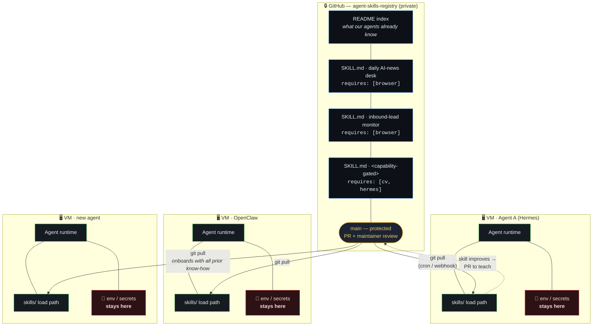
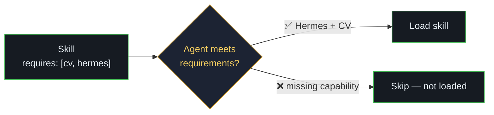

# `agent-skills-registry` — Shared Skill Registry

**One private Git repo is the single source of truth for what our agents know how to do.**
Playbooks travel through the repo; **credentials never do** — they stay per-VM.

> **Pull to learn, push to teach.** When one agent's skill improves, it opens a PR.
> After review, every other agent inherits it on the next `git pull`.

---

## The model



---

## Why this matters

| Before | After this repo |
| --- | --- |
| Skills are one-off files trapped on whichever VM built them | Skills are **reusable company assets** every agent can inherit |
| Onboarding a new agent = rebuild knowledge from scratch | New agent `git pull`s our **accumulated know-how** on day one |
| A better playbook stays with one agent | One PR → **every agent gets the upgrade** on next sync |
| Sharing capability risks sharing secrets | **Know-how is shared; secrets stay per-VM** |

---

## What is a "skill"?

A skill is a **playbook** plus a `requires:` block declaring its dependencies.
**An agent only loads skills whose requirements it can meet.**

```yaml
# SKILL.md frontmatter
name: daily-ai-news-desk
requires: [browser]          # portable — any agent with a browser can run it
---
# or, capability-gated:
requires: [cv, hermes]       # only Hermes agents with computer-vision load this
```



This cleanly separates **portable** skills (news desk, lead monitor — `requires: [browser]`)
from **capability-gated / runtime-specific** ones. The README index tags each so anyone
can see at a glance what travels everywhere vs. what needs a specific runtime.

---

## Governance & security

- **Access control + per-VM credentials** — each VM authenticates independently (read-only token or per-VM key); revoke one without touching the others.
- **`main` is protected.** Nobody commits straight to it. Changes go through a **PR reviewed by a small set of maintainers** who verify the `requires:` block before other agents inherit the skill.
- **Secrets never enter the repo.** Only playbooks travel; credentials and access live in each VM's environment. Shared know-how, *not* shared secrets.

---

## First step

The whole design hinges on **one unknown**: *where each runtime loads skills from on the VM.*
Confirming that load path (per runtime — Hermes, OpenClaw) is task #1; everything else is standard Git.

---

> ### 📌 Note on how capability-gated skills come about
> Some skills only work reliably because the authoring agent built extra tooling to support
> them — for example, writing its own **computer-vision (screen-reading)** helper when the
> off-the-shelf path wasn't robust enough. That CV capability is exactly the kind of thing the
> `requires:` block gates on, and why some skills are capability-tagged rather than universally
> portable.
